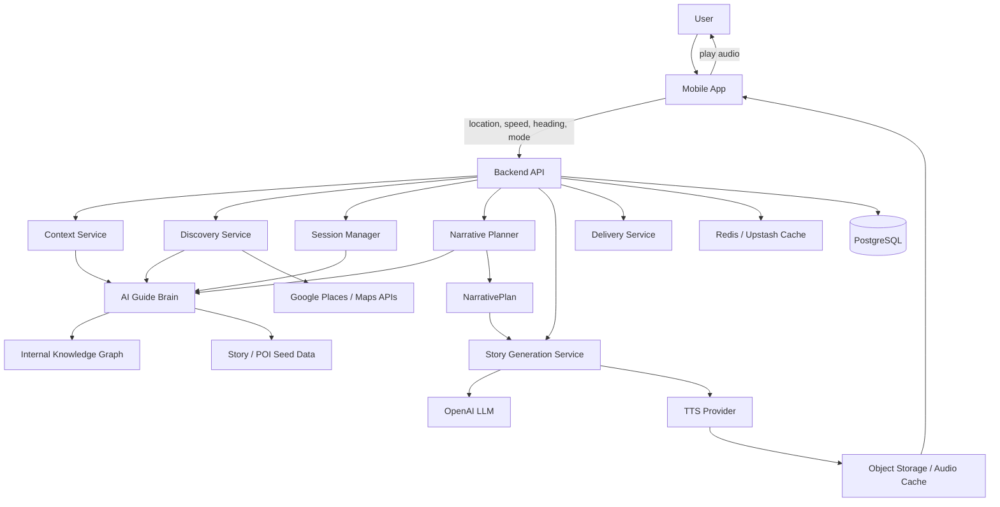

# 01 — System Overview

## Purpose

This document explains the top-level architecture of Hey City.

Hey City is a mobile-first, voice-first AI city guide. The product detects user movement, understands nearby or upcoming points of interest, selects the right story, generates a guide-specific narration, and delivers safe audio to the user.

## Core rule

The LLM does not decide what to say, when to say it, or why.

The backend brain and deterministic services decide:
- active context
- POI selection
- timing
- story type
- story duration
- safety constraints
- guide/persona

The LLM only formulates text from a `NarrativePlan`.

## Diagram

## Block responsibilities

| Block | Responsibility |
|---|---|
| Mobile App | Map UI, location tracking, mode selection, audio playback, user interaction |
| Backend API | Validates requests, exposes product endpoints, coordinates services |
| Context Service | Normalizes raw GPS, speed, heading, app state, and mode |
| Discovery Service | Finds candidate POIs and evaluates whether a story should trigger |
| Session Manager | Tracks walk/drive session state, cooldowns, active narration, history |
| AI Guide Brain | Orchestrates context, story selection, safety, persona, and planning |
| Narrative Planner | Produces structured `NarrativePlan`; no prose generation |
| Story Generation Service | Converts `NarrativePlan` into guide-specific narration |
| Delivery Service | Handles TTS, audio caching, playback metadata |
| Knowledge Graph | Internal enriched city data: POIs, stories, themes, facts, relationships |
| Redis / Upstash | Cache for POI lookups, ETA, story text, TTS audio metadata, rate limits |
| PostgreSQL | Persistent users, sessions, POIs, saved places, history, story nodes |
| Object Storage | Cached generated audio and media assets |
| Google APIs | Places discovery, directions, distance/ETA; backend only |
| OpenAI | LLM, STT, initial TTS option |
| ElevenLabs | Optional/premium TTS voice layer |

## MVP implementation stance

For early MVP:
- local NYC Financial District POI seed is allowed
- mock narration is preferred before LLM/TTS integration
- production providers should not be required for deterministic tests
- all thresholds and provider limits must live in config/env
