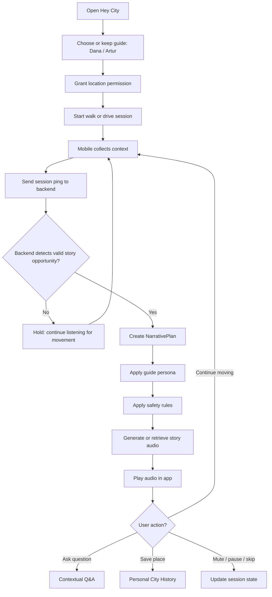

# 02 — Product User Flow

## Purpose

This document explains the user-facing product loop.

The MVP promise is simple:

The user opens Hey City, starts walking or driving, and the app safely tells relevant short stories about the city at the right moment.

## Diagram

## Main user states

| State | Meaning |
|---|---|
| Idle | App open, no active walk/drive session |
| Exploring | User is moving or browsing map |
| Listening | Story audio is playing |
| Muted | Discovery may continue, but narration should not start |
| Asking | User asks a contextual follow-up |
| Vehicle Mode | Audio-first, safety-constrained mode |
| Session Ended | Walk/drive was stopped or timed out |

## Guide selection

MVP guides:
- Dana — curated city insider, lifestyle, hidden gems, aesthetic experiences
- Artur — charming historian, history, architecture, context

Implementation note:
- docs and code should use `Artur` unless a final naming correction to `Arthur` is explicitly made
- persona system must remain extensible
- do not hardcode business logic to only two guides

## Vehicle Mode rules

Vehicle Mode must prioritize safety:
- 30–45 second story target
- audio-first
- minimal visual text
- no complex UI
- no rapid guide switching
- no mid-story interruption from heading jitter
- large controls only: mute, pause, skip
