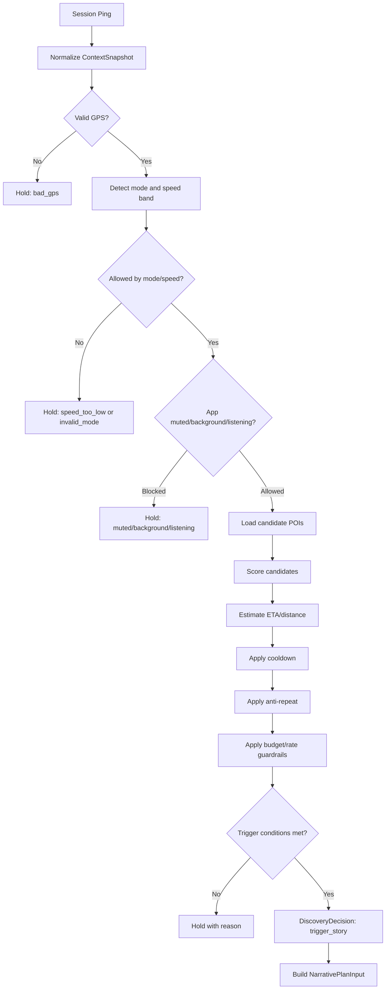
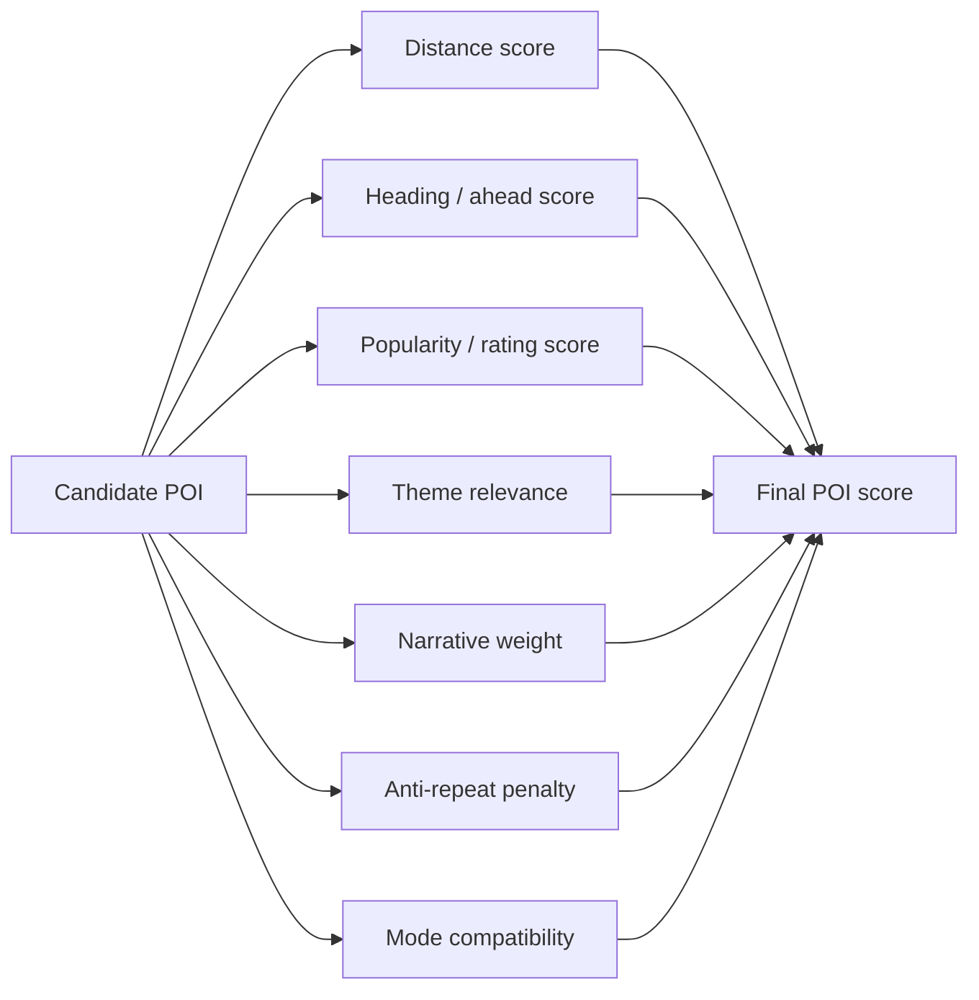

# 03 — Drive Discovery Engine

## Purpose

Drive Discovery is the core product engine.

It decides whether the user is near or approaching a meaningful point of interest, and whether the app should trigger a story.

This must be deterministic and testable before LLM, TTS, Google production APIs, or UI polish are added.

## High-level flow



## Core inputs

| Input | Description |
|---|---|
| latitude / longitude | User position |
| speed | Real speed from device when available |
| heading | Direction of movement |
| mode | walking, vehicle, explore |
| session state | active story, cooldown, previous POIs |
| app state | foreground, background, muted, listening |
| preferences | guide, themes, language |
| provider budget | quota and cost guardrails |

## Core outputs

The Discovery Engine should return a `DiscoveryDecision`.

```ts
type DiscoveryDecision =
  | {
      type: "trigger_story";
      poiId: string;
      triggerReason: "eta" | "distance" | "manual";
      etaSeconds?: number;
      distanceMeters: number;
      mode: "walking" | "vehicle" | "explore";
      narrativePlanInput: NarrativePlanInput;
    }
  | {
      type: "hold";
      reason:
        | "bad_gps"
        | "speed_too_low"
        | "invalid_mode"
        | "muted"
        | "backgrounded"
        | "already_listening"
        | "cooldown_active"
        | "anti_repeat"
        | "no_candidate"
        | "budget_guardrail"
        | "eta_too_soon"
        | "eta_too_late";
    };
```

## Candidate scoring



## Config values

All values must live in config/env, not hardcoded.

Examples:
- `PING_INTERVAL_SECONDS`
- `VEHICLE_MIN_SPEED_KMH`
- `WALKING_MAX_SPEED_KMH`
- `VEHICLE_STORY_MIN_SECONDS`
- `VEHICLE_STORY_MAX_SECONDS`
- `DISCOVERY_COOLDOWN_SECONDS`
- `ANTI_REPEAT_HOURS`
- `GPS_STALE_SECONDS`
- `HEADING_GRACE_SECONDS`
- `NEARBY_CACHE_TTL_SECONDS`
- `ETA_CACHE_TTL_SECONDS`
- `TOP_K_ETA_CANDIDATES`
- `GOOGLE_DAILY_BUDGET_LIMIT`

## Test priorities

Must be covered with pure unit or replay tests:
- speed/mode gating
- distance and heading checks
- ETA trigger logic
- cooldown
- anti-repeat
- bad GPS handling
- active story survival through GPS jitter
- fallback distance trigger
- cache key behavior
- budget guardrail behavior
