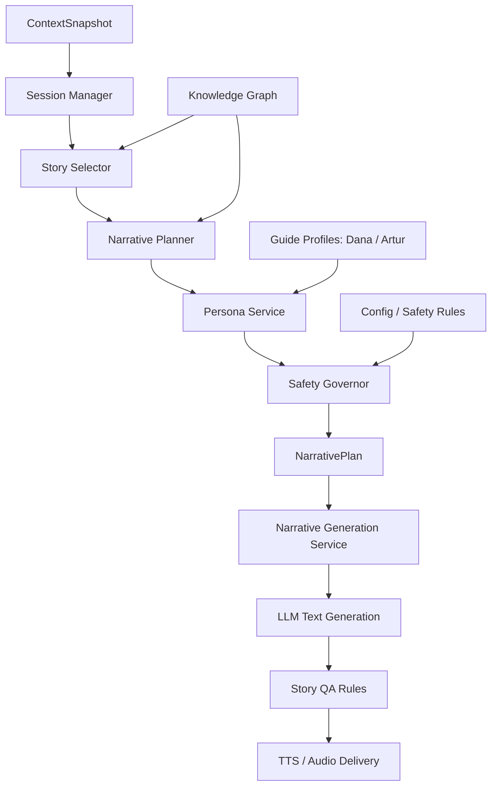

# 04 — AI Guide Brain

## Purpose

The AI Guide Brain is the orchestration layer that turns movement context and POI candidates into a safe, guide-specific narrative experience.

It is not a single LLM prompt.

It is a set of deterministic services that produce structured plans before any generation occurs.

## Diagram



## Block responsibilities

| Block | Responsibility |
|---|---|
| ContextSnapshot | Normalized location, speed, heading, mode, app state |
| Session Manager | Tracks active session, active story, cooldown, repeated POIs |
| Story Selector | Chooses the POI and story angle from candidates |
| Narrative Planner | Creates structured `NarrativePlan`; no prose |
| Persona Service | Applies Dana/Artur voice constraints |
| Safety Governor | Enforces Vehicle Mode and frequency/length limits |
| Narrative Generation Service | Sends structured prompt to LLM or mock generator |
| Story QA Rules | Checks length, safety, factual anchors, banned patterns |
| TTS / Audio Delivery | Converts final narration to audio or mock playback |

## Key principle

```text
Brain decides.
LLM formulates.
```

The LLM must not:
- choose POIs
- decide trigger timing
- override Vehicle Mode safety
- invent the route
- decide story duration
- switch guides arbitrarily

## Persona layer

MVP personas:
- Dana: lifestyle, hidden gems, aesthetic, low factual overload
- Artur: history, architecture, cultural context

The system must support:
- one active guide at a time
- no guide switching during Vehicle Mode narration
- optional soft handoff only between segments
- guide-specific narration style
- shared NarrativePlan contract

## Vehicle Mode safety

The Safety Governor must enforce:
- 30–45 second target
- short sentences
- no long text blocks
- no complex instructions
- no UI-dependent narration
- no sudden guide switching
- no interruption caused only by short heading change
