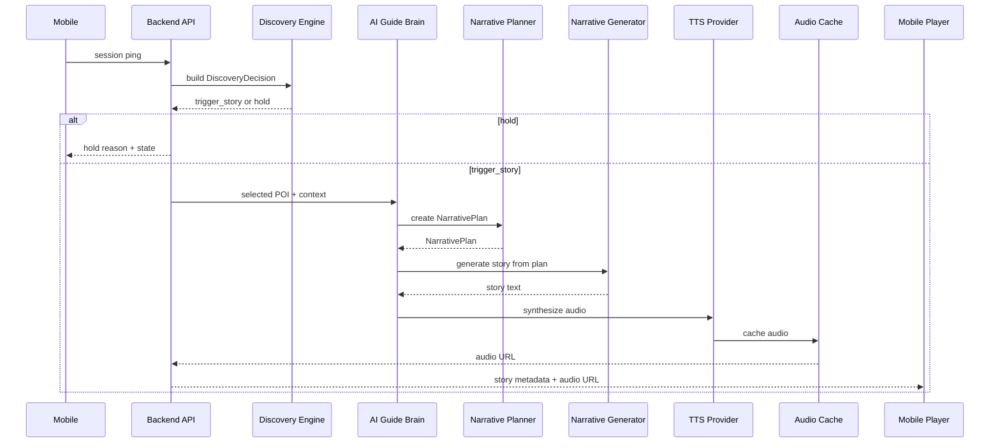

# 05 — NarrativePlan Flow

## Purpose

`NarrativePlan` is the contract between deterministic product logic and generative AI.

It prevents the LLM from making product decisions.

## Flow



## NarrativePlan shape

Recommended MVP shape:

```ts
type NarrativePlan = {
  planId: string;
  sessionId: string;
  poiId: string;
  guideId: "dana" | "arthur";
  mode: "walking" | "vehicle" | "explore";

  language: string;
  targetDurationSeconds: number;

  storyType:
    | "area_intro"
    | "poi_story"
    | "transition"
    | "hidden_gem"
    | "historical_context"
    | "architecture_note"
    | "closing";

  theme: "history" | "architecture" | "culture" | "food" | "urban_legend" | "hidden_fact" | "lifestyle";

  hook: string;
  factualAnchors: Array<{
    label: string;
    value: string;
    source?: string;
  }>;

  angle: string;
  mustMention: string[];
  mustAvoid: string[];

  safety: {
    vehicleSafe: boolean;
    maxSentenceCount?: number;
    maxWords?: number;
    allowVisualInstructions: boolean;
  };

  delivery: {
    textOnly: boolean;
    audioPreferred: boolean;
    cacheKey: string;
  };
};
```

## Mock generation rule

Before LLM integration, `NarrativePlan` should be convertible into deterministic mock text.

Example:

```text
[Arthur] Federal Hall is just ahead. This site matters because it connects directly to the earliest days of American government. In Vehicle Mode, keep this short: one strong fact, one piece of context, and a clean ending.
```

## QA checks

Story output should be checked for:
- target duration
- vehicle-safe wording
- no long instructions
- factual anchors included
- no invented facts beyond plan
- persona consistency
- no guide overlap
