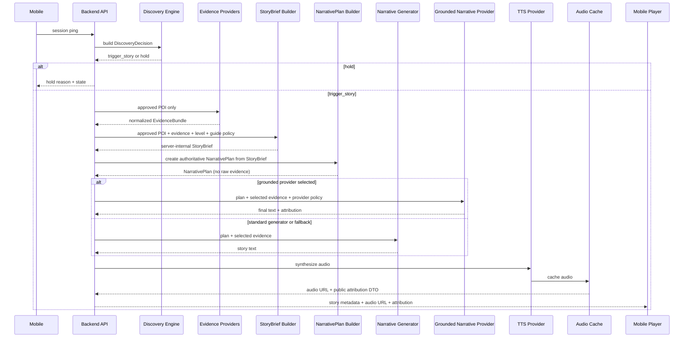

# 05 — NarrativePlan Flow

## Purpose

`NarrativePlan` is the contract between deterministic product logic and generative AI.

It prevents the LLM from making product decisions.

## Flow


```mermaid
sequenceDiagram
    participant Mobile
    participant API as Backend API
    participant Discovery as Discovery Engine
    participant Evidence as Evidence Providers
    participant Brief as StoryBrief Builder
    participant Planner as NarrativePlan Builder
    participant Generator as Narrative Generator
    participant Grounded as Grounded Narrative Provider
    participant TTS as TTS Provider
    participant Storage as Audio Cache
    participant Player as Mobile Player

    Mobile->>API: session ping
    API->>Discovery: build DiscoveryDecision
    Discovery-->>API: trigger_story or hold

    alt hold
        API-->>Mobile: hold reason + state
    else trigger_story
        API->>Evidence: approved POI only
        Evidence-->>API: normalized EvidenceBundle
        API->>Brief: approved POI + evidence + level + guide policy
        Brief-->>API: server-internal StoryBrief
        API->>Planner: create authoritative NarrativePlan from StoryBrief
        Planner-->>API: NarrativePlan (no raw evidence)
        alt grounded provider selected
            API->>Grounded: plan + selected evidence + provider policy
            Grounded-->>API: final text + attribution
        else standard generator or fallback
            API->>Generator: plan + selected evidence
            Generator-->>API: story text
        end
        API->>TTS: synthesize audio
        TTS->>Storage: cache audio
        Storage-->>API: audio URL + public attribution DTO
        API-->>Player: story metadata + audio URL + attribution
    end
```

## Grounded generation boundary

`NarrativePlan` remains authoritative regardless of the selected provider. A grounded model may
find supporting information and formulate language, but it must not choose the POI, discovery
profile, story level, distance wording, duration, or interruption policy.

Two provider contracts are kept separate:

```ts
interface EvidenceProvider {
  collect(input: EvidenceRequest): Promise<EvidenceBundle>;
}

interface GroundedNarrativeProvider {
  generate(input: GroundedNarrativeRequest): Promise<GroundedNarrativeResult>;
}
```

- `EvidenceProvider` returns reusable, normalized factual claims from sources whose terms allow
  that use.
- `GroundedNarrativeProvider` returns final user-facing text plus the citations and attribution
  required by that provider.
- Provider-specific restrictions on storage, transformation, language, geography, and attribution
  travel with the result and are enforced before caching or delivery.
- A deterministic or evidence-only generator remains the fallback when grounded generation is
  unavailable.

## Canonical M1 construction order

The executable M1 contract supersedes the older illustrative `Planner -> NarrativePlan -> Evidence`
shape in this document. The only valid order is:

```text
approved discovery decision
  -> EvidenceBundle (server-only)
  -> StoryBrief (server-only, selected claim IDs and continuation context)
  -> authoritative NarrativePlan (shared DTO, no raw source prose)
  -> NarrativeGenerator / AITaskRouter
  -> TTS + public NarrativeAttribution
```

`EvidenceBundle` and `StoryBrief` never cross the mobile boundary. `NarrativeAttribution` contains
only a display label and optional safe URL; it is rendered as a credit and is never supplied to or
spoken by the model.

## M2 journey context

An active `DriveSession` owns one bounded, server-only `JourneyState`. A ping updates its movement
and area from already available discovery candidates. After Discovery approves a target, the
StoryBrief builder receives a validated JourneyContext snapshot. It can select unused evidence,
rotate narrative beats, or attach a callback to a completed earlier moment with a shared product
topic. It cannot change the approved target or Discovery ranking. The public `MomentPlan` carries
only `priorContextRefs`; raw transcripts and exact movement coordinates remain server-only.
Callbacks bind to the intended target and require a narrow topic grounded in verified evidence;
broad profile tags such as `history` never qualify alone. After a confirmed callback, the session
requires the configured number of ordinary completed stories before another callback can appear,
including callbacks previously planned for an abandoned target.

Generating narration stages a moment but does not mark it heard. Only a confirmed finish records
completed evidence and entity memory. Skipped and superseded stories cannot become callback
sources. Optional durable `poi_listened` history metadata is written at completion for signed-in
users with history enabled; guest and history-disabled sessions still keep in-memory continuity.
At session start, an opted-in signed-in user receives at most 20 completed history records from
the last 30 days as coarse entity, topic, and evidence anti-repeat context. Historical records
cannot become in-session callback sources. A finish request carries the moment ID returned with
playback, so a delayed callback cannot finish a newer story.
Bounded product events in `usage_events` use coarse location buckets and omit transcripts and raw
evidence. Journey planning adds no LLM or Maps lookup.

## NarrativePlan shape

Recommended MVP shape:

```ts
type NarrativePlan = {
  planId: string;
  sessionId: string;
  poiId: string;
  guideId: "dana" | "arthur";
  mode: "walking" | "vehicle" | "explore";

  language: string;
  targetDurationSeconds: number;

  storyType:
    | "area_intro"
    | "poi_story"
    | "transition"
    | "hidden_gem"
    | "historical_context"
    | "architecture_note"
    | "closing";

  theme: "history" | "architecture" | "culture" | "food" | "urban_legend" | "hidden_fact" | "lifestyle";

  hook: string;
  factualAnchors: Array<{
    label: string;
    value: string;
    source?: string;
  }>;

  angle: string;
  mustMention: string[];
  mustAvoid: string[];

  safety: {
    vehicleSafe: boolean;
    maxSentenceCount?: number;
    maxWords?: number;
    allowVisualInstructions: boolean;
  };

  delivery: {
    textOnly: boolean;
    audioPreferred: boolean;
    cacheKey: string;
  };
};
```

## Mock generation rule

`NarrativePlan` must remain convertible into deterministic mock text for tests and provider outages.

Example:

```text
[Arthur] Federal Hall is just ahead. This site matters because it connects directly to the earliest days of American government. In Vehicle Mode, keep this short: one strong fact, one piece of context, and a clean ending.
```

## QA checks

Story output should be checked for:
- target duration
- vehicle-safe wording
- no long instructions
- factual anchors included
- no invented facts beyond plan
- persona consistency
- no guide overlap

## Implemented generation boundary

The active Walking and Drive path uses one boundary:

```ts
NarrativePlan
  -> NarrativeGenerator
  -> AITaskRouter(final_storytelling)
  -> GenerativeProvider(OpenAI)
  -> TTS
```

`driveSession` creates the authoritative plan and passes that exact object forward. The generation
layer does not rebuild the plan and cannot choose another POI, alter the trigger, change the mode,
or recalculate duration.

`StoryBrief` keeps the complete normalized evidence bundle server-side but deterministically selects
the claim IDs available to each segment. A short receives at most two claims; a continuation receives
only the remaining claims and is offered only when at least two unused verified claims remain. The
spoken-word budget is a maximum derived from both safety duration and selected-claim count, so sparse
evidence ends early instead of being padded with invented detail.

Text cache identity includes prompt/policy/evidence versions, the authoritative plan, POI, language,
theme, style, duration, guide, selected evidence, and a hash of continuation context. This prevents
Dana and Arthur or short/long/continuation contexts from sharing cached prose. The default primary
storytelling model is `gpt-5.6-luna`, with an environment override through `OPENAI_TEXT_MODEL`;
deterministic routing and provider abstraction remain unchanged.
