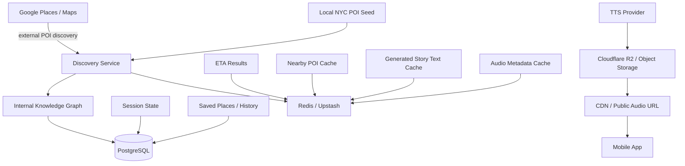

# 06 — Data and Storage

## Purpose

This document separates volatile discovery data from persistent city knowledge, session history, and generated media.

## Diagram

## Storage roles

| Storage | Role |
|---|---|
| Local JSON seed | Development fallback and deterministic tests |
| Google Places | External discovery source |
| PostgreSQL | Persistent product data |
| Redis / Upstash | Cache and rate limits |
| Cloudflare R2 | Generated audio files and media |
| Mobile local storage | Auth token, settings, cached light state |

## PostgreSQL MVP entities

Recommended later-stage MVP tables:
- users
- user_profiles
- sessions
- session_events
- pois
- poi_facts
- story_nodes
- narrative_plans
- generated_stories
- saved_places
- guide_profiles
- tours
- tour_stops

Do not introduce all tables before deterministic core is stable.

## Local POI seed

A local seed should exist for NYC Financial District.

Purpose:
- test without Google API
- avoid cost during development
- support route replay tests
- enable deterministic demo

Recommended fields:
- id
- name
- lat
- lng
- category
- role
- themes
- narrativeWeight
- factualAnchors
- shortDescription
- source
