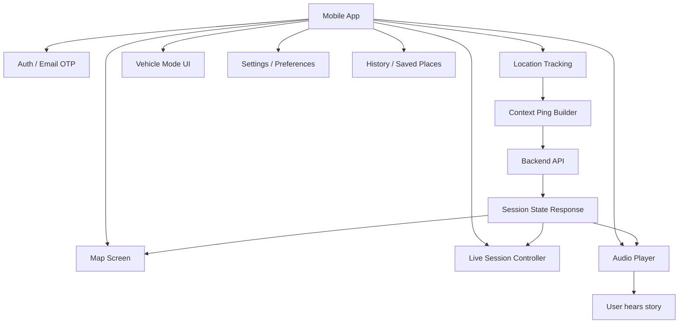

# 07 — Mobile Architecture

## Purpose

This document explains the mobile app responsibilities and boundaries.

The mobile app should collect context, present the map/audio UI, and send pings. It should not contain Google Places/Directions/Matrix secrets or make POI discovery decisions.

## Diagram

## Mobile responsibilities

| Area | Responsibility |
|---|---|
| Auth | Email OTP flow and token handling |
| Location | Foreground location, speed, heading, permission status |
| Map | Current position, nearby/active POI markers, mode context |
| Live Session | Start, ping, stop session |
| Vehicle Mode | Audio-first safe UI |
| Audio Player | Play cached/generated audio, pause, mute, skip |
| Settings | Guide, language, themes, privacy |
| History | Saved places and listened stories |

## Mobile must not do

- call Google Places directly
- store Google API keys
- decide POI trigger timing
- generate story text
- call LLM directly
- call TTS directly
- override backend safety rules

## Vehicle Mode UI

Allowed:
- current guide
- active story title
- audio progress
- large pause/mute/skip controls
- minimal text

Avoid:
- long story text
- dense cards
- complex map interactions
- rapid UI changes
- guide switching while narration is active

## Dev/test mode

Mobile should include a developer simulation mode:
- replay route points
- simulate speed/heading
- show ping status
- show backend decision reason
- support testing without walking/driving
