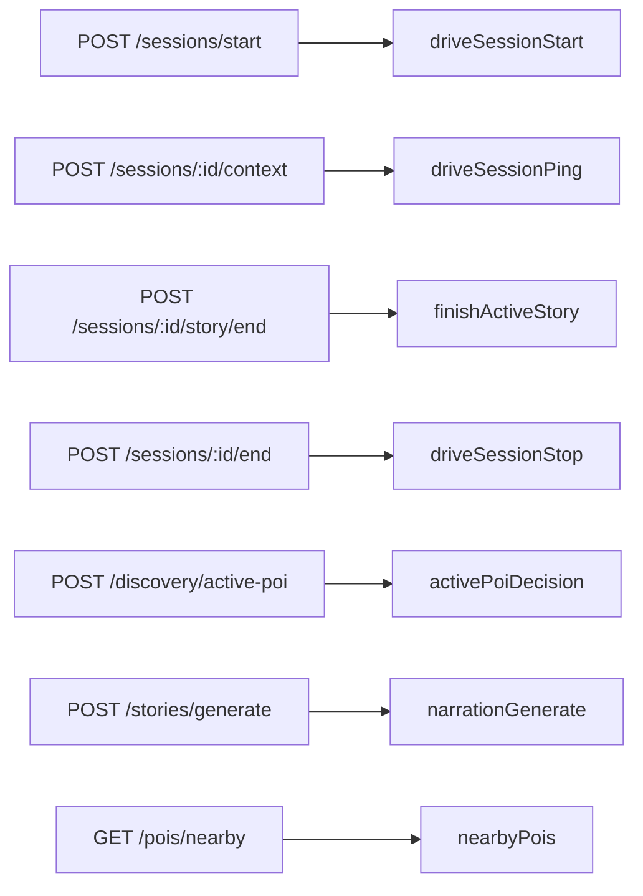

# 08 — Backend API Boundaries

## Purpose

This document explains backend API boundaries and how current `/drive/*` endpoints relate to canonical API names.

## Current MVP endpoints

```text
/auth/otp/send
/auth/otp/verify
/me
/drive/session/start
/drive/session/ping
/drive/session/story/finish
/drive/session/stop
/narration/generate
```

## Canonical API aliases

The existing `/drive/*` endpoints may remain during MVP, but canonical aliases should be added as thin wrappers.



## API boundary principles

Backend API should:
- validate all requests
- normalize error responses
- hide provider details from mobile
- enforce budget/rate limits
- enforce Vehicle Mode safety
- return safe degraded responses

Backend API should not:
- expose provider keys
- let mobile choose provider internals
- let LLM decide POI/timing
- return raw provider errors to mobile

## Recommended response shape

```ts
type ApiSuccess<T> = {
  ok: true;
  data: T;
  requestId: string;
};

type ApiError = {
  ok: false;
  error: {
    code: string;
    message: string;
    details?: unknown;
  };
  requestId: string;
};
```

## Session ping response

```ts
type SessionPingResponse = {
  sessionId: string;
  decision: DiscoveryDecision;
  activePoi?: PoiSummary;
  story?: {
    storyId: string;
    narrativePlanId: string;
    guideId: "dana" | "arthur";
    title: string;
    text?: string;
    audioUrl?: string;
    targetDurationSeconds: number;
  };
};
```

## Testing priorities

- request validation
- invalid GPS
- auth required
- session not found
- active story already playing
- provider quota fallback
- canonical alias maps to current implementation
