# 09 — Repository Structure

## Purpose

This document explains the intended repository organization.

Current working repo may use `server/` as the backend folder. Treat `server/` as the backend directory unless a separate rename decision is made.

## Diagram

```mermaid
flowchart TD
    R[Repo Root] --> M[mobile/]
    R --> S[server/]
    R --> SH[shared/]
    R --> D[docs/]
    R --> SC[scripts/]
    R --> A[AGENTS.md]
    R --> DEC[DECISIONS.md]

    M --> M1[React Native / Expo app]
    M --> M2[Map + location]
    M --> M3[Audio player]
    M --> M4[Vehicle Mode UI]

    S --> S1[Express API]
    S --> S2[Drive Discovery core]
    S --> S3[Auth/Profile]
    S --> S4[Provider adapters]
    S --> S5[Tests]

    SH --> SH1[DTOs]
    SH --> SH2[Shared types]
    SH --> SH3[Validation schemas]

    D --> D1[Architecture docs]
    D --> D2[Context docs]
    D --> D3[Reference docs]

    SC --> SC1[Seed scripts]
    SC --> SC2[Route replay]
    SC --> SC3[QA utilities]
```

## Responsibilities

### `mobile/`

Owns:
- app screens
- location permissions
- live map
- Vehicle Mode UI
- audio playback
- local settings

Does not own:
- Google Places discovery
- LLM/TTS calls
- trigger timing logic

### `server/`

Owns:
- API endpoints
- auth and profile
- session lifecycle
- Discovery Engine
- NarrativePlan creation
- provider adapters
- cache/budget logic
- tests for deterministic core

### `shared/`

Owns:
- API DTOs
- shared TypeScript types
- validation schemas where useful
- common constants only when safe

Avoid putting secrets or provider config here.

### `docs/`

Owns:
- architecture diagrams
- product decisions
- API references
- context transfer files

### `scripts/`

Owns:
- seed data utilities
- route simulation
- QA scripts
- local developer helpers

## Codex guidance

Before modifying structure:
1. inspect current files
2. identify touched files
3. prefer small changes
4. avoid mechanical renames during stabilization
5. update docs when contracts change
