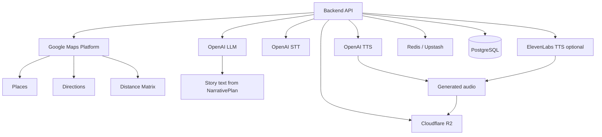

# 10 — Provider Integration

## Purpose

This document defines boundaries for external providers.

Providers should be added only after deterministic core is stable.

## Provider map

## MVP provider decisions

| Area | MVP decision |
|---|---|
| Map | Google Maps SDK |
| POI discovery | Google Places on backend only |
| ETA/distance | Google Distance Matrix / Directions on backend only |
| LLM | OpenAI |
| STT | OpenAI |
| TTS | OpenAI first |
| Premium TTS | ElevenLabs optional |
| Audio storage | Cloudflare R2 |
| Cache | Redis / Upstash |
| DB | PostgreSQL |

## Integration order

Recommended order:
1. deterministic local seed
2. Redis cache / rate limits
3. Google Places sandbox integration
4. Google ETA integration
5. OpenAI LLM from NarrativePlan
6. OpenAI TTS
7. Cloudflare R2 audio cache
8. ElevenLabs voice experiment

## Provider failure handling

Every provider adapter must return safe degraded responses.

Examples:
- Google quota reached -> use local seed or cached POIs
- ETA failure -> distance fallback
- LLM failure -> deterministic mock story
- TTS failure -> text-only response
- object storage failure -> direct text/mock audio unavailable
- Redis failure -> continue with reduced caching if safe
- STT failure -> disable voice input but preserve map/audio loop

## Security rules

- no Google Places/Directions/Matrix keys in mobile
- no LLM/TTS keys in mobile
- no secrets in git
- no `.env` committed
- provider config via env only
- budget limits via config/env
