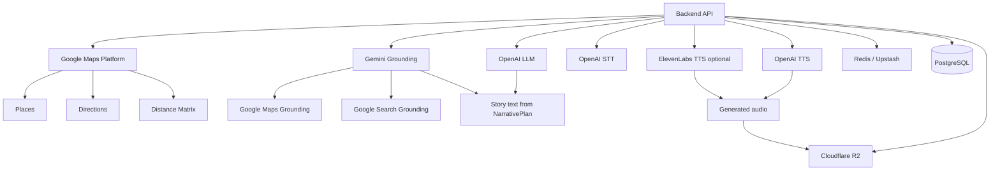

# 10 — Provider Integration

## Purpose

This document defines boundaries for external providers.

Providers should be added only after deterministic core is stable.

## Provider map


```mermaid
flowchart TD
    API[Backend API] --> Maps[Google Maps Platform]
    API --> LLM[OpenAI LLM]
    API --> Gemini[Gemini Grounding]
    API --> STT[OpenAI STT]
    API --> TTS1[OpenAI TTS]
    API --> TTS2[ElevenLabs TTS optional]
    API --> R2[Cloudflare R2]
    API --> Redis[Redis / Upstash]
    API --> DB[(PostgreSQL)]

    Maps --> M1[Places]
    Maps --> M2[Directions]
    Maps --> M3[Distance Matrix]
    Gemini --> G1[Google Maps Grounding]
    Gemini --> G2[Google Search Grounding]

    LLM --> G[Story text from NarrativePlan]
    Gemini --> G
    TTS1 --> A[Generated audio]
    TTS2 --> A
    A --> R2
```

## MVP provider decisions

| Area | MVP decision |
|---|---|
| Map | Google Maps SDK |
| POI discovery | Google Places on backend only |
| ETA/distance | Google Distance Matrix / Directions on backend only |
| LLM | OpenAI |
| Grounded narrative | Gemini Maps/Search behind `GroundedNarrativeProvider`; standard generator remains fallback |
| STT | OpenAI |
| TTS | OpenAI first |
| Premium TTS | ElevenLabs optional |
| Audio storage | Cloudflare R2 |
| Cache | Redis / Upstash |
| DB | PostgreSQL |

## Integration order

Recommended order:
1. deterministic local seed
2. Redis cache / rate limits
3. Google Places sandbox integration
4. Google ETA integration
5. OpenAI LLM from NarrativePlan
6. OpenAI TTS
7. Cloudflare R2 audio cache
8. ElevenLabs voice experiment

## Accepted grounded narrative contour

Grounding is an optional narrative-generation path, not a replacement for deterministic
Discovery or `NarrativePlan`.

```ts
type GroundingMode = "maps" | "search";

type GroundedNarrativeResult = {
  text: string;
  provider: string;
  groundingMode: GroundingMode;
  citations: Array<{ title: string; url: string }>;
  attribution?: {
    displayText?: string;
    links: Array<{ title: string; url: string }>;
  };
  policy: {
    mayCache: boolean;
    mayTransform: boolean;
    expiresAt?: string;
  };
};
```

Routing rules:

- Gemini Maps Grounding is eligible only for English POI narratives with clear geographic intent.
- Gemini Search Grounding is eligible for other supported languages and for official, municipal,
  historical, or local web sources.
- Maps-grounded output and its attribution metadata stay together through API, UI, transcript, and
  session history.
- Maps data is not promoted into the reusable evidence store.
- If grounding is unavailable, too slow, over budget, unsupported for the requested language, or
  cannot satisfy attribution requirements, route to the standard evidence-based generator.
- TTS may speak the returned narrative, but the visual transcript must retain required citations
  and attribution.
- Provider selection, budget limits, timeout, and fallback order are config-driven.

## Provider failure handling

Every provider adapter must return safe degraded responses.

Examples:
- Google quota reached -> use local seed or cached POIs
- ETA failure -> distance fallback
- LLM failure -> deterministic mock story
- TTS failure -> text-only response
- object storage failure -> direct text/mock audio unavailable
- Redis failure -> continue with reduced caching if safe
- STT failure -> disable voice input but preserve map/audio loop

## Security rules

- no Google Places/Directions/Matrix keys in mobile
- no LLM/TTS keys in mobile
- no secrets in git
- no `.env` committed
- provider config via env only
- budget limits via config/env
